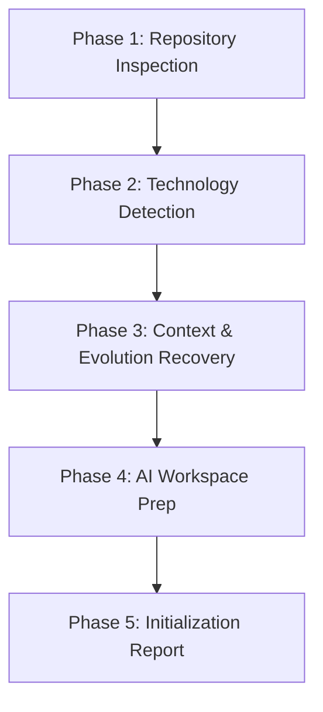

# TIDOS Bootstrap Engine Specification (v1.1)

The **TIDOS Bootstrap Engine** (`bootstrap.md`) is responsible for initializing, inspecting, and preparing target software repositories for TIDOS-governed AI operations. Positioned at **Level 2** in the TIDOS Subsystem Boot Hierarchy, the Bootstrap Engine establishes complete context and workspace readiness upon session entry or framework installation.

---

## 1. Core Mandates & Invariants

1. **Non-Destructive Application Isolation (Strict Read-Only Rule)**
   The Bootstrap Engine **never** modifies, deletes, or creates application source code, business logic, configuration files, or database schemas during initialization. Its scope is strictly limited to repository analysis, context discovery, and AI workspace metadata preparation.

2. **Operating System Freeze Compliance**
   The Bootstrap Engine treats all `.tidos/` system files (Kernel through Research, templates, plugins) as immutable. Any new workspace initialization artifacts are created exclusively in `.tidos/evolution/` or project root documentation scaffolds.

3. **Idempotency Invariant**
   Executing the bootstrap sequence repeatedly on the same repository must yield identical results without errors, duplicate artifacts, state corruption, or unnecessary file overwrites.

4. **Universal Project Compatibility**
   The engine must successfully initialize any codebase regardless of language, framework, project maturity, or current git state (empty project, monolith, or legacy codebase).

---

## 2. Bootstrap Lifecycle & Execution Flow

The Bootstrap Engine executes a 5-phase sequential initialization flow:



---

## 3. Phase Details

### Phase 1: Repository Inspection & Discovery
The engine scans the target workspace to construct an initial topology map.

- **Directory Scanning**: Analyzes root folder structure, identifying existing documentation, build targets, and configuration folders.
- **Git State Assessment**: Checks if the directory is a git repository, identifies active branch, uncommitted changes, and recent commit history.
- **Tooling Verification**: Checks host OS, shell type, and available runtime binaries (`git`, `node`, `python`, `flutter`, `docker`, etc.).

---

### Phase 2: Automated Technology Stack Detection
The engine inspects project manifests to automatically identify primary languages, frameworks, package managers, and build systems:

| Manifest / Signature File | Detected Stack / Framework | Primary Tooling Inferred |
| :--- | :--- | :--- |
| `pubspec.yaml` | Flutter / Dart | `flutter`, `dart` |
| `package.json` | Node.js / TypeScript / React / Next.js | `npm`, `pnpm`, `yarn`, `bun` |
| `pyproject.toml`, `requirements.txt` | Python | `python`, `pip`, `uv`, `poetry` |
| `Cargo.toml` | Rust | `cargo` |
| `go.mod` | Go | `go` |
| `pom.xml`, `build.gradle(.kts)` | Java / Kotlin / Android Native | `gradle`, `mvn` |
| `Dockerfile`, `docker-compose.yml` | Containerized Infrastructure | `docker`, `docker-compose` |
| `CMakeLists.txt`, `Makefile` | C / C++ Native Build | `cmake`, `make`, `gcc`, `clang` |

---

### Phase 3: Context & Evolution Recovery
To resume work seamlessly across sessions, the engine recovers past project context and evolution intelligence:

1. **Evolution Layer Hydration**: Reads `.tidos/evolution/` files:
   - `PROJECT_PROFILE.md` (Domain profile & active stack parameters)
   - `USER_PREFERENCES.md` & `METHODOLOGY.md` (User preferences & observed working habits)
   - `PROJECT_HISTORY.md` (Session history & previous reflections)
   - `LEARNINGS.md`, `PATTERNS.md`, `BEST_PRACTICES.md` (Institutional knowledge)
   - `APPROVED.md` & `ROADMAP.md` (Approved OS improvements & evolution roadmap)
2. **Session Log Inspection**: Checks active memory logs for past task history or active workflows.
3. **Implementation Plan Recovery**: Scans for active `implementation_plan.md` or `walkthrough.md` files to identify incomplete user directives.

---

### Phase 4: AI Workspace Preparation & Documentation Generation
The engine ensures the workspace contains required TIDOS governance structure without touching application code:

- **Governance Verification**: Verifies presence of `.tidos/` directory structure (`kernel.md`, `identity.md`, `bootstrap.md`, `workflow.md`, `roles.md`, `architecture.md`, `memory.md`, `learning.md`, `quality.md`, `research.md`).
- **Evolution Layer Verification**: Ensures `.tidos/evolution/` contains all 13 standard evolution files. If any are missing, creates clean placeholder scaffolds.
- **Missing Infrastructure Artifacts**: If standard root documentation (`TIDSTART.md`, `README.md`, `VERSION.md`, `CHANGELOG.md`) or system subdirectories (`templates/`, `plugins/`, `evolution/`, `lab/`) are missing, the engine creates clean placeholder scaffolds.
- **Idempotency Guard**: Existing files with populated content are preserved untouched.

---

### Phase 5: Initialization Report Generation
Upon completion, the engine compiles a structured **TIDOS Initialization Report** presented directly to the user:

```markdown
# TIDOS Initialization Report (v1.1)

- **Workspace Path**: `d:\work\Dev\TIDOS`
- **Host OS**: Windows (PowerShell)
- **Detected Stack**: Polyglot / TIDOS Framework Root
- **Git Branch**: `main` (Clean working tree)
- **Evolution Layer Status**: Hydrated (13 files active)
- **Context Status**: Hydro-recovering active task sequence
- **System Readiness**: Level 0-6 Mounted & Synchronized.

## Next Steps
System is fully initialized and ready for prompt execution.
```

---

## 4. Idempotency & Safety Protocol

```
IF file_exists(target_path) AND file_has_content(target_path):
    SKIP (Preserve existing file)
ELSE IF target_path IS application_source_code OR target_path IS frozen_system_file:
    SKIP (Strict Read-Only Enforcement)
ELSE:
    CREATE_OR_UPDATE_GOVERNANCE_ARTIFACT(target_path)
```
