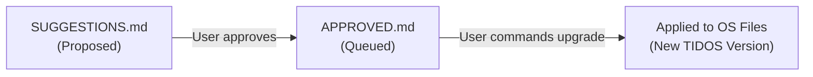

# TIDOS Approved Improvements

This file records TIDOS OS improvement suggestions that have been **explicitly approved by the user**. Approved items are queued for application during the next TIDOS version upgrade.

---

## Approval Workflow

1. Agent identifies improvement → appends to `SUGGESTIONS.md` with status `Proposed`.
2. User reviews and approves → entry is moved to `APPROVED.md` with status `Approved`.
3. User commands "Upgrade TIDOS" → approved items are applied to frozen OS files and a new version is tagged.

---

## Approved Improvements Queue

*No approved improvements yet. Entries will appear here when the user approves suggestions from SUGGESTIONS.md.*
