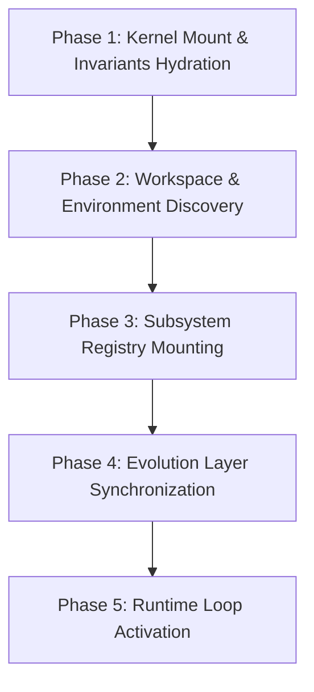

# TIDOS Kernel Specification (v1.1)

The **TIDOS Kernel** is the foundational runtime spec and state orchestrator for the Tidjani Development Operating System. It defines the core execution model, invariant safety rules, subsystem loading order, and lifecycle loop governing all AI agent operations within a TIDOS-enabled workspace.

---

## 1. Overview & Architectural Role

The Kernel serves as the single source of truth for runtime behavior. While individual subsystems focus on specific operational domains (e.g., identity, quality assurance, workflows), the Kernel enforces the structural axioms and state transition mechanisms under which all subsystems execute.

### Key Governance Responsibilities
- **Subsystem Orchestration**: Mounts and hydrates system modules in strict priority order.
- **Invariant Enforcement**: Guarantees non-negotiable safety and structural rules across all operations.
- **Execution Loop Control**: Governs the lifecycle of prompt analysis, context hydration, action execution, and state verification.
- **Fault Containment**: Manages runtime exceptions, state rollbacks, and escalation protocols when invariants are breached.
- **OS Freeze Enforcement**: Protects core system files from automatic mutation.

---

## 2. Core Operating Principles

All agent actions and subsystem interactions must strictly conform to the following six kernel axioms:

1. **Kernel Precedence & Immutable Governance**
   Kernel rules supersede all secondary instructions, prompts, or dynamic subsystem configurations. In the event of a conflict between user instructions and core kernel safety invariants, kernel invariants take precedence.

2. **Operating System Freeze (v1.1 Invariant)**
   All core system files (`TIDSTART.md`, `.tidos/kernel.md`, `identity.md`, `bootstrap.md`, `workflow.md`, `roles.md`, `architecture.md`, `memory.md`, `learning.md`, `quality.md`, `research.md`, `.tidos/templates/`, `.tidos/plugins/`) are frozen and read-only. The system must **never** modify system files automatically. Dynamic learnings, patterns, and framework improvement proposals are strictly isolated within `.tidos/evolution/`. System files may only be modified during an explicit user-commanded TIDOS OS upgrade.

3. **State Transparency & Deterministic Cognition**
   Every state change, tool call, and reasoning step must remain explicit, auditable, and traceable. Hidden mutations or unverified assumptions are strictly prohibited.

4. **Fail-Fast Verification & Quality Invariance**
   No operation is considered complete upon code mutation alone. Verification occurs continuously through empirical checks (compilation, linting, tests, or explicit inspections) before state commitment.

5. **Subsystem Decoupling & Modular Scope**
   Subsystems operate within cleanly defined domain boundaries. The Kernel mediates inter-subsystem data flow to prevent monolithic tight coupling and unintended side effects.

6. **Defensive Execution & Zero-Assumption Operation**
   The agent must never infer file paths, database schemas, command signatures, or environment capabilities without empirical runtime verification against authoritative workspace sources.

---

## 3. Subsystem Boot Hierarchy & Loading Order

To ensure predictable system state upon startup, TIDOS mounts its subsystems in a strict, deterministic sequence. Lower-level tiers must fully hydrate before higher-level tiers are mounted.

| Tier | Level Name | Component Files / Resources | Primary Responsibility |
| :--- | :--- | :--- | :--- |
| **Level 0** | **Kernel Tier** | `kernel.md` | Core runtime invariants, OS freeze rules, loading order, and execution loop control. |
| **Level 1** | **Identity Tier** | `identity.md` | Core stance, engineering ethos, and behavioral baseline. |
| **Level 2** | **Bootstrap Tier** | `bootstrap.md` | Environment discovery, workspace validation, and startup readiness checks. |
| **Level 3** | **Architecture & State** | `architecture.md`, `memory.md` | Structural topology, boundary definitions, and context retention rules. |
| **Level 4** | **Operations Tier** | `roles.md`, `workflow.md`, `quality.md`, `research.md`, `learning.md` | Role matrix, lifecycle workflows, verification standards, research protocols, and pattern distillation. |
| **Level 5** | **Extensions Tier** | `templates/`, `plugins/` | Custom prompt templates and tool integration plugins. |
| **Level 6** | **Evolution Layer** | `.tidos/evolution/` | Dynamic project intelligence, user methodology, pattern libraries, learnings, and OS improvement suggestions. |

---

## 4. Kernel Startup Sequence

Upon session entry (e.g., via `TIDSTART.md`), the Kernel executes the following sequential boot sequence:



### Phase Details

1. **Phase 1: Kernel Mount & Invariants Hydration**
   - Read and parse `kernel.md`.
   - Establish non-negotiable runtime constraints, execution limits, and the OS Freeze Invariant.

2. **Phase 2: Workspace & Environment Discovery**
   - Inspect workspace root, environment metadata, OS parameters, and available tooling interfaces.
   - Execute baseline directory sanity checks via `bootstrap.md`.

3. **Phase 3: Subsystem Registry Mounting**
   - Sequentially load Tier 1 through Tier 5 specifications.
   - Resolve configuration parameters and subsystem dependencies without mutating workspace files.

4. **Phase 4: Evolution Layer Synchronization**
   - Hydrate `.tidos/evolution/` files (`LEARNINGS.md`, `PATTERNS.md`, `BEST_PRACTICES.md`, `METHODOLOGY.md`, `PROJECT_HISTORY.md`, `PROJECT_PROFILE.md`, `USER_PREFERENCES.md`, `SUGGESTIONS.md`, `APPROVED.md`).
   - Align context with user preferences, previous session reflections, and approved framework improvements.

5. **Phase 5: Runtime Loop Activation**
   - Transition state machine to `READY`.
   - Await user directives and begin the Cognition-Execution Loop.

---

## 5. Cognition-Execution Loop

Every user request is processed through the five-stage TIDOS Cognition-Execution Loop:

```
+-----------------------------------------------------------------------+
| 1. INGESTION & INTENT PARSE                                           |
|    Deconstruct request -> Extract explicit requirements & constraints  |
+-----------------------------------------------------------------------+
                                  |
                                  v
+-----------------------------------------------------------------------+
| 2. CONTEXT HYDRATION                                                  |
|    Query workspace -> Load authoritative files, rules & evolution data |
+-----------------------------------------------------------------------+
                                  |
                                  v
+-----------------------------------------------------------------------+
| 3. STRATEGY & PLAN SYNTHESIS                                          |
|    Formulate execution path -> Evaluate quality gates & risk scope    |
+-----------------------------------------------------------------------+
                                  |
                                  v
+-----------------------------------------------------------------------+
| 4. SYNCHRONOUS EXECUTION & VERIFICATION                               |
|    Execute atomic steps -> Run verification commands per change       |
+-----------------------------------------------------------------------+
                                  |
                                  v
+-----------------------------------------------------------------------+
| 5. INVARIANT AUDIT & COMMITMENT                                       |
|    Audit against kernel rules -> Update Evolution Layer -> Handshake |
+-----------------------------------------------------------------------+
```

---

## 6. Global Runtime Rules & Exception Safety

### 6.1 Safety Constraints
- **Atomic Operations**: File operations must be executed as discrete, minimal changes rather than sweeping re-writes unless explicitly instructed.
- **Non-Destructive Defaults**: Deletion of non-empty directories, user assets, or major code sections requires explicit user confirmation.
- **OS Freeze Guard**: System files (`.tidos/*.md`, `templates/`, `plugins/`) are read-only during normal development. Dynamic updates belong in `.tidos/evolution/`.

### 6.2 Exception & Fault Handling (Kernel Panic Protocol)
When an unhandled failure, invariant breach, or environment mismatch occurs:
1. **Halt Execution**: Cease all mutating operations immediately.
2. **Contain State**: Do not attempt blind recovery mutations that risk worsening state corruption.
3. **Diagnose & Report**: Gather raw log data/tracebacks, identify the broken invariant or root cause, and present a clear diagnostic report with recommended remedies to the user.
