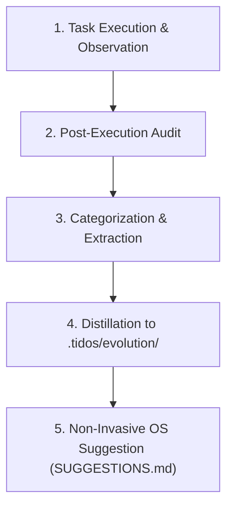

# TIDOS Continuous Learning Engine Specification (v1.1)

The **TIDOS Learning Engine** (`learning.md`) defines the continuous self-improvement lifecycle for AI operations across software projects. Positioned at **Level 4** in the TIDOS Subsystem Boot Hierarchy, this specification ensures that every completed task, bug fix, and architectural refactoring distills insights that refine project standards, eliminate repeated mistakes, and evolve TIDOS governance over time.

---

## 1. The Core Learning Mandate

```
INVARIANT: No feature implementation, refactoring task, or bug fix is considered 
           fully complete until a Learning Audit has been conducted.
           All learnings, patterns, and OS suggestions are stored strictly in .tidos/evolution/.
```

The Learning Engine transforms ephemeral task experience into persistent repository intelligence. Rather than treating code generation as disposable output, TIDOS treats every execution cycle as a data point for optimizing codebase quality and developer experience.

---

## 2. The Learning Lifecycle



### Lifecycle Phases

1. **Observation**: Monitor errors, build failures, edge-case bugs, user working habits, or unexpected refactoring friction during task execution.
2. **Post-Execution Audit**: Conduct a structured self-reflection upon reaching task completion (Stage 8 of [workflow.md](file:///d:/work/Dev/TIDOS/.tidos/workflow.md)).
3. **Categorization**: Classify learnings into **Mistakes/RCA**, **Reusable Patterns**, **Validated Best Practices**, **User Methodology**, or **OS Improvement Proposals**.
4. **Distillation**: Record formatted entries into `.tidos/evolution/` (`LEARNINGS.md`, `PATTERNS.md`, `BEST_PRACTICES.md`, `METHODOLOGY.md`).
5. **OS Suggestion Protocol**: If a TIDOS Operating System file could be improved, append the proposal to `.tidos/evolution/SUGGESTIONS.md`. **Never mutate frozen OS files directly.**

---

## 3. Learning Dimensions

### 3.1 Mistake Analysis & Root-Cause Post-Mortems (`LEARNINGS.md`)
When a build breaks, a unit test fails, or an unhandled edge case occurs:
- **Root-Cause Analysis (RCA)**: Identify *why* the failure occurred.
- **Prevention Rule**: Formulate an explicit, actionable rule to prevent the exact same failure in future tasks.
- **Record Entry**: Append to `.tidos/evolution/LEARNINGS.md`.

---

### 3.2 Pattern Discovery & Boilerplate Extraction (`PATTERNS.md`)
When a solution has been successfully reused across two or more modules:
- **Canonical Blueprint**: Format the solution as a canonical code pattern.
- **Pattern Recording**: Append/update entry in `.tidos/evolution/PATTERNS.md`. Never duplicate patterns; improve existing ones.

---

### 3.3 Validated Best Practices (`BEST_PRACTICES.md`)
When an engineering approach is empirically validated by project success:
- **Record Entry**: Document description, concrete benefits, honest trade-offs, and recommended usage in `.tidos/evolution/BEST_PRACTICES.md`.

---

### 3.4 User Methodology Learning (`METHODOLOGY.md` & `USER_PREFERENCES.md`)
- **Silent Observation**: Observe user choices for tech, project structures, review depth, coding style, and debugging workflow.
- **Consistency Rule**: Record in `METHODOLOGY.md` only after a preference appears consistently across 3+ interactions.
- **Explicit Directives**: Store explicit user directives immediately in `USER_PREFERENCES.md`.

---

### 3.5 OS Self-Improvement Suggestion System (`SUGGESTIONS.md`)
Whenever the agent discovers a way to improve the TIDOS Operating System itself:
- **Zero Direct OS Mutation**: The agent must **never** modify frozen system files automatically.
- **Suggestion Entry**: Append a detailed proposal to `.tidos/evolution/SUGGESTIONS.md` (Title, Problem, Proposed Solution, Benefits, Risks, Affected Modules, Impact, Priority).
- **Await Approval**: Wait for user explicit approval (`APPROVED.md`) before applying during an official OS upgrade.

---

## 4. Evolution Layer Mapping

```
                       +----------------------+
                       |  Learning Audit      |
                       +----------------------+
                                  |
         +------------------------+------------------------+
         |                        |                        |
         v                        v                        v
+------------------+     +------------------+     +------------------+
|   LEARNINGS.md   |     |   PATTERNS.md    |     |  SUGGESTIONS.md  |
| (Bug fixes & RCA)|     | (Reusable Code)  |     | (OS Proposals)   |
+------------------+     +------------------+     +------------------+
         |                        |                        |
         v                        v                        v
+------------------+     +------------------+     +------------------+
|BEST_PRACTICES.md |     | METHODOLOGY.md   |     |  APPROVED.md     |
| (Proven Practices|     | (User Habits)    |     | (Queued Upgrades)|
+------------------+     +------------------+     +------------------+
```
