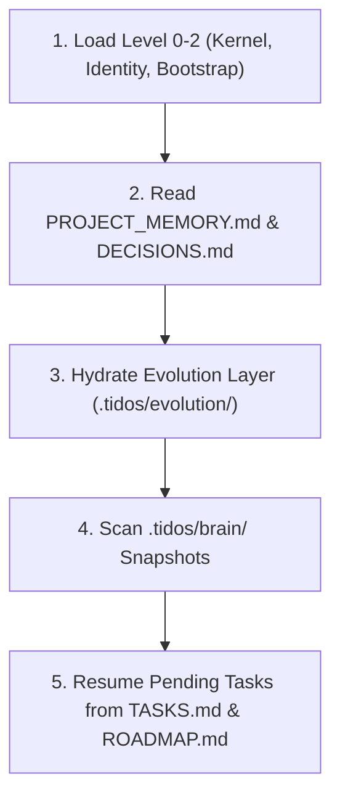

# TIDOS Memory Engine Specification (v1.1)

The **TIDOS Memory Engine** (`memory.md`) governs project state persistence, context window retention, architectural decision records, and cross-session continuity. Positioned at **Level 3** in the TIDOS Subsystem Boot Hierarchy alongside `architecture.md`, this specification ensures that project intelligence survives AI agent switches, context resets, and session restarts.

---

## 1. Core Memory Architecture

To prevent context drift and memory loss, TIDOS structures memory into four distinct operational tiers:

```
+-----------------------------------------------------------------------+
| 1. WORKING MEMORY (Ephemeral Context Window / Active Session State)   |
+-----------------------------------------------------------------------+
                                  |
                                  v
+-----------------------------------------------------------------------+
| 2. PROJECT MEMORY (`PROJECT_MEMORY.md` & Root Project Artifacts)     |
+-----------------------------------------------------------------------+
                                  |
                                  v
+-----------------------------------------------------------------------+
| 3. EVOLUTION LAYER (`.tidos/evolution/` Dynamic Intelligence)        |
+-----------------------------------------------------------------------+
                                  |
                                  v
+-----------------------------------------------------------------------+
| 4. PERSISTENT BRAIN (`.tidos/brain/` Knowledge Graphs & Indexes)     |
+-----------------------------------------------------------------------+
```

### Memory Tiers Breakdown
1. **Working Memory (Tier 1)**: Transient conversation history and tool outputs. Managed actively during a single session; cleared upon model restart.
2. **Project Memory (Tier 2)**: Human-readable markdown files (`PROJECT_MEMORY.md`, `CHANGELOG.md`, `TASKS.md`, `DECISIONS.md`) maintained in the workspace root.
3. **Evolution Layer (Tier 3)**: Evolving project intelligence artifacts (`.tidos/evolution/LEARNINGS.md`, `PATTERNS.md`, `BEST_PRACTICES.md`, `METHODOLOGY.md`, `PROJECT_HISTORY.md`, `PROJECT_PROFILE.md`, `USER_PREFERENCES.md`, `SUGGESTIONS.md`, `APPROVED.md`, `REJECTED.md`, `ROADMAP.md`, `VERSION_HISTORY.md`).
4. **Persistent Brain (Tier 4)**: Structured index files, knowledge items (KIs), and state snapshots stored inside `.tidos/brain/`.

---

## 2. Memory Classification: What to Remember

### 2.1 Critical Invariants (Never Forget)
The following memory items must **never** be lost or ignored:
- **Core Architectural Decisions**: Framework choices, database schemas, layer boundaries (`DECISIONS.md`).
- **User Preferences & Methodology**: Explicit user choices (`USER_PREFERENCES.md`) and observed working habits (`METHODOLOGY.md`).
- **Security & Authorization Rules**: Secret isolation rules, auth policies, permission boundaries.
- **Breaking Changes & Deprecations**: Deprecated APIs, custom workspace build quirks.

### 2.2 Active Operational Context
- **Active Task Progress**: Pending checklist items in `TASKS.md` or `implementation_plan.md`.
- **Known Technical Debt**: Known performance bottlenecks, temporary workarounds, or refactoring items.
- **Project Patterns**: Reusable snippets, custom state management conventions (`.tidos/evolution/PATTERNS.md`).
- **Unresolved Edge Cases**: Bugs or boundary failures identified during testing (`.tidos/evolution/LEARNINGS.md`).

---

## 3. Directory & File Organization

Project memory is organized deterministically across standard project files and the `.tidos/evolution/` system folder:

```
d:/work/Dev/TIDOS/
├── PROJECT_MEMORY.md            # High-level project state & active task snapshot
├── CHANGELOG.md                 # Version milestone history & release notes
├── DECISIONS.md                 # Architectural Decision Records (ADRs)
│
├── .tidos/evolution/            # Dynamic Evolution Layer
│   ├── LEARNINGS.md             # Post-mortems, RCA & prevention rules
│   ├── PATTERNS.md              # Reusable solution templates & blueprints
│   ├── BEST_PRACTICES.md        # Empirically validated practices with trade-offs
│   ├── METHODOLOGY.md           # Observed user working habits & style
│   ├── PROJECT_HISTORY.md       # Chronological session logs & reflections
│   ├── PROJECT_PROFILE.md       # Domain profile & active stack parameters
│   ├── USER_PREFERENCES.md      # Explicit user choices & directives
│   ├── SUGGESTIONS.md           # Non-invasive OS improvement proposals
│   ├── APPROVED.md              # User-approved OS upgrades ready to apply
│   ├── REJECTED.md              # Rejected proposals (prevents repeat suggestions)
│   ├── ROADMAP.md               # Evolution roadmap
│   └── VERSION_HISTORY.md       # SemVer version log
│
└── .tidos/brain/                # Persistent AI Brain Storage
    ├── context_snapshot.json    # Machine-readable environment & session state
    └── index.json               # Key-value map of codebase symbols & documentation
```

---

## 4. Context Recovery & Session Continuity Protocol

When an AI agent starts a new session, switches models (e.g., Gemini <-> Claude <-> GPT), or recovers from a context reset, it must execute the **TIDOS Context Recovery Sequence**:



---

## 5. Memory Update Lifecycle & Triggers

Memory files are updated at specific lifecycle triggers defined in Stage 7 & Stage 8 of [workflow.md](file:///d:/work/Dev/TIDOS/.tidos/workflow.md):

| Update Trigger | Affected Memory File | Required Update Content |
| :--- | :--- | :--- |
| **Task Completion** | `PROJECT_MEMORY.md`, `TASKS.md` | Mark task completed, update active feature status. |
| **Post-Task Learning Audit**| `.tidos/evolution/LEARNINGS.md` | Log root cause analysis, mistake prevention rules, successes. |
| **Solution Reused Multi-times**| `.tidos/evolution/PATTERNS.md` | Promote solution to canonical pattern entry. |
| **Engineering Practice Validated**| `.tidos/evolution/BEST_PRACTICES.md`| Record practice with description, benefits, and trade-offs. |
| **Consistent User Behavior**| `.tidos/evolution/METHODOLOGY.md` | Record observed methodology preference (3+ occurrences). |
| **Explicit User Preference**| `.tidos/evolution/USER_PREFERENCES.md`| Record explicit directive immediately. |
| **OS Improvement Discovered**| `.tidos/evolution/SUGGESTIONS.md` | Append proposal (never mutate frozen OS files). |
| **Session Sign-Off** | `.tidos/evolution/PROJECT_HISTORY.md`| Append concise session reflection. |

---

## 6. Model Interoperability & Resiliency

To ensure memory survives complete AI model switches (e.g., moving between different LLM providers or IDE clients):

1. **Human-Readable Format**: All primary memory storage relies on standard GitHub-Flavored Markdown (`.md`), ensuring readability by any LLM or human engineer.
2. **Machine-Readable Indexing**: Structural metadata is duplicated in `.tidos/brain/*.json` for fast programmatic search.
3. **Zero Proprietary Locking**: Memory contains zero model-specific syntax or proprietary tokens.
