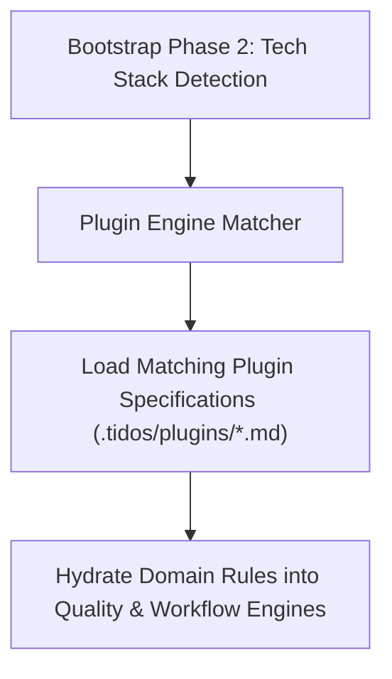

# TIDOS Plugin Engine Specification (v1.0)

The **TIDOS Plugin Engine** (`.tidos/plugins/`) enables dynamic, automated specialization of the TIDOS operating system based on the technology stack detected by the [bootstrap.md](file:///d:/work/Dev/TIDOS/.tidos/bootstrap.md) engine. Operating at **Level 5** in the Subsystem Boot Hierarchy, plugins provide domain-specific standards, quality rules, and research triggers.

---

## 1. Plugin Architecture & Lifecycle

### Plugin Schema Invariants
Every plugin specification file in `.tidos/plugins/` strictly adheres to an 8-part standard schema:
1. **Overview & Domain Scope**
2. **Detection Rules** (Manifest signatures, file patterns, environment flags)
3. **Initialization Steps** (Setup actions executed when plugin mounts)
4. **Documentation to Generate** (Domain-specific doc scaffolds)
5. **Best Practices** (Recommended architectural & design patterns)
6. **Coding Standards** (Language/framework-specific clean code rules)
7. **Review & Quality Rules** (Domain-specific quality gates)
8. **Research Topics** (Proactive technology watch areas)
