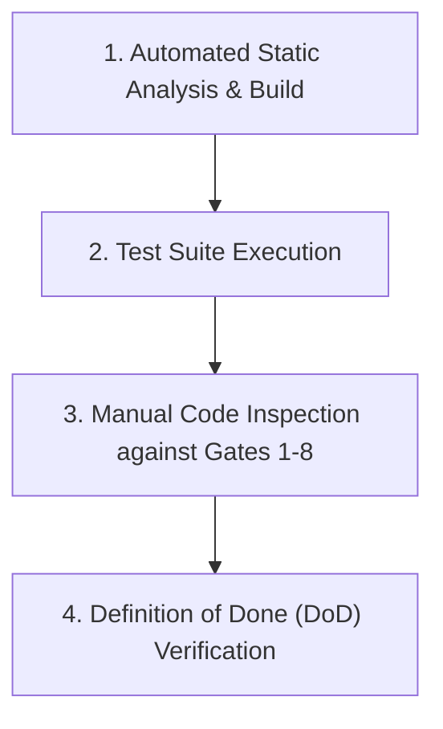

# TIDOS Quality Engine Specification (v1.0)

The **TIDOS Quality Engine** (`quality.md`) defines the mandatory quality gates, verification procedures, and the formal Definition of Done (DoD) governing all code modifications within a TIDOS-enabled workspace. Positioned at **Level 4** in the TIDOS Subsystem Boot Hierarchy, this specification ensures that no code is committed without passing rigorous multi-dimensional quality audits.

---

## 1. Core Quality Mandate

```
INVARIANT: Code modification alone never equals task completion. 
           Passing all applicable Quality Gates is mandatory before state commitment.
```

The Quality Engine acts as the strict verification filter between Stage 5 (Implementation) and Stage 10 (Completion) of [workflow.md](file:///d:/work/Dev/TIDOS/.tidos/workflow.md).

---

## 2. Multi-Dimensional Quality Gates

### Gate 1: Architecture & SOLID Invariants
- [ ] **Layer Boundaries**: Code strictly respects Clean Architecture layer boundaries (`Presentation` -> `Domain` <- `Data` -> `Core`).
- [ ] **SOLID Principles**: Single responsibility per class; high-level business logic depends on interfaces, not implementations.
- [ ] **API Contract Integrity**: Public function signatures, DTO contracts, and route parameters remain backwards-compatible.

---

### Gate 2: Code Hygiene, Readability & Maintainability
- [ ] **Naming Conventions**: Files use `snake_case`, classes use `PascalCase`, variables/functions use `camelCase`.
- [ ] **Zero Dead Code**: Unused variables, unreachable code paths, and debug print statements (`print()`, `console.log()`) are completely removed.
- [ ] **Zero Code Duplication**: Reusable logic is extracted into shared utilities or base components.
- [ ] **Lint Compliance**: Zero lint warnings or compiler errors remain in modified files.

---

### Gate 3: Error Handling & Logging
- [ ] **Typed Failure Propagation**: Domain errors are represented as typed failure objects or result unions, never unhandled exceptions.
- [ ] **Non-Silent Trapping**: No empty `catch` blocks or swallowed errors. Every exception logs context-rich failure details.
- [ ] **Structured Logging**: Log entries use appropriate severity levels (`DEBUG`, `INFO`, `WARN`, `ERROR`).
- [ ] **Secret Protection in Logs**: No access tokens, API keys, passwords, or PII are written to log files.

---

### Gate 4: Security & Vulnerability Mitigation
- [ ] **Input Sanitization**: All user inputs, URL parameters, and API request payloads are sanitized and validated.
- [ ] **Zero Hardcoded Secrets**: Secrets, keys, and credentials are isolated in `.env` files or secure key vaults.
- [ ] **Dependency Health**: No third-party packages contain critical unpatched security CVEs.
- [ ] **Auth & Scope Enforcement**: Authorization checks are verified on every protected resource endpoint.

---

### Gate 5: Performance & Resource Efficiency
- [ ] **Async Non-Blocking**: Heavy computation or I/O operations execute asynchronously off main UI event loops.
- [ ] **Memory Allocation**: No memory leaks, circular reference retains, or un-disposed stream subscriptions exist.
- [ ] **Firestore Cost Controls**: All Firestore queries contain explicit `.limit()` bounds; redundant document reads are eliminated via caching or data aggregation.
- [ ] **Supabase Policy Verification**: Row Level Security (RLS) is enabled and verified with `auth.uid()` policies on all target tables.

---

### Gate 6: UI, UX & Accessibility Standards
- [ ] **Design System Alignment**: Visual tokens (colors, typography, spacing) match established design system rules.
- [ ] **Interaction States**: Interactive UI elements render distinct hover, active, focused, disabled, and loading states.
- [ ] **Accessibility (WCAG 2.1 AA)**: Visual text satisfies minimum contrast ratios (4.5:1); semantic tags/labels exist for screen readers.
- [ ] **Responsive Layout**: Layouts adapt seamlessly across targeted screen viewports without visual clipping or overflow errors.

---

### Gate 7: Automated Testing & Coverage
- [ ] **Unit Testing**: Business logic use cases and repository mappers are covered by unit tests.
- [ ] **Integration Testing**: End-to-end data flows across modules execute cleanly.
- [ ] **Regression Isolation**: Fixes for reported bugs are accompanied by regression tests validating the fix.

---

### Gate 8: Documentation & Knowledge Sync
- [ ] **Code Docstrings**: Public methods and API contracts contain clear inline documentation.
- [ ] **Project Artifact Sync**: `CHANGELOG.md`, `PROJECT_MEMORY.md`, and `TASKS.md` are updated to reflect completed changes.

---

## 3. Standard Quality Review Procedure

When performing a Quality Review (Stage 6 of `workflow.md`), the agent must follow this 4-step verification sequence:



1. **Step 1: Build & Static Analysis**: Run project linting and compilation tools (`flutter analyze`, `tsc`, `eslint`, `pytest`, `cargo check`).
2. **Step 2: Automated Test Execution**: Execute unit and integration test runners (`flutter test`, `npm test`, `pytest`).
3. **Step 3: Multi-Gate Code Inspection**: Methodically review modified code line-by-line against Gates 1 through 8.
4. **Step 4: DoD Sign-Off**: Validate that all Definition of Done checklist conditions are satisfied.

---

## 4. Master Definition of Done (DoD)

A task in TIDOS is officially **DONE** when and only when all of the following 10 conditions are true:

```
+-----------------------------------------------------------------------+
|                       MASTER DEFINITION OF DONE                       |
+-----------------------------------------------------------------------+
| [✓] 1. Implementation fully satisfies user prompt requirements.       |
| [✓] 2. Zero compilation, build, or syntax errors.                      |
| [✓] 3. Zero static analyzer or lint warnings.                         |
| [✓] 4. All automated unit and integration tests pass cleanly.         |
| [✓] 5. Clean Architecture layer separation strictly preserved.       |
| [✓] 6. Security, sanitization, and secret isolation verified.         |
| [✓] 7. Performance and database query bounds (Firestore/Postgres) met.|
| [✓] 8. UI/UX responsive and WCAG 2.1 AA accessibility compliant.      |
| [✓] 9. Relevant project documentation (CHANGELOG, memory) updated.    |
| [✓] 10. Self-review checklist completed with zero open TODO items.     |
+-----------------------------------------------------------------------+
```
