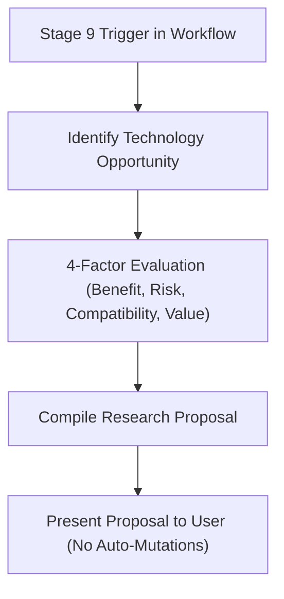

# TIDOS Research Engine Specification (v1.0)

The **TIDOS Research Engine** (`research.md`) defines the continuous technology evaluation and proposal framework for TIDOS-governed projects. Positioned at **Level 4** in the TIDOS Subsystem Boot Hierarchy, this specification empowers AI agents to proactively explore superior packages, frameworks, MCP tools, and developer productivity solutions while maintaining complete safety.

---

## 1. Core Research Invariant

```
INVARIANT: The Research Engine generates recommendations ONLY. 
           It must NEVER apply code, configuration, or dependency changes 
           automatically without explicit user instruction and approval.
```

The Research Engine acts as an advisory intelligence layer operating during Stage 9 (Proactive Research) of [workflow.md](file:///d:/work/Dev/TIDOS/.tidos/workflow.md).

---

## 2. Recommendation Assessment Framework

Every research proposal or technology recommendation generated by the agent must be evaluated against four mandatory factors:

```
+-----------------------------------------------------------------------+
| 1. BENEFIT          | What tangible advantage does this provide?       |
+---------------------+-------------------------------------------------+
| 2. RISK             | What are the potential security/breaking risks? |
+---------------------+-------------------------------------------------+
| 3. COMPATIBILITY    | Does it fit existing architecture & stack?    |
+---------------------+-------------------------------------------------+
| 4. ESTIMATED VALUE  | What is the ROI (Impact vs Migration Effort)?   |
+-----------------------------------------------------------------------+
```

### Assessment Factor Definitions
1. **Benefit**: Specific improvements to performance, developer velocity, code maintainability, security, or user experience.
2. **Risk**: Migration complexity, breaking changes, license restrictions, or dependency deprecation risks.
3. **Compatibility**: Alignment with host OS, target language versions, existing database schemas, and Clean Architecture rules (`architecture.md`).
4. **Estimated Value**: Quantified trade-off rating (Low / Medium / High / Game-Changer) balancing implementation effort against business impact.

---

## 3. Targeted Research Domains

### 3.1 Model Context Protocol (MCP) Discovery
- **Server Discovery**: Search available MCP servers (e.g., database tools, filesystem extensions, API monitors) that can expand agent capabilities.
- **Integration Safety**: Verify MCP server tool schemas and permission boundaries before recommending installation.

### 3.2 Package & Dependency Research
- **Package Auditing**: Benchmark third-party packages on package registries (`pub.dev`, `npm`, `PyPI`, `Crates.io`, `Go packages`).
- **Health Indicators**: Check package maintenance activity, community adoption, open issues, and security vulnerability history.

### 3.3 Framework & Stack Technology Watch
- **Flutter & Cross-Platform**: Track Flutter SDK updates, modern state management developments, and native performance optimizations.
- **Firebase & Cloud**: Monitor Cloud Functions runtime updates, Firestore feature additions, and security rule improvements.
- **Supabase & Postgres**: Research new Supabase extensions, vector storage options (pgvector), and RLS performance tweaks.
- **AI & LLM Tooling**: Track advancements in local LLM runtimes, vector database indexes, and prompt optimization frameworks.

### 3.4 Developer Productivity & Automation
- **CI/CD Optimization**: Identify faster build runners, caching mechanisms, or parallel test execution workflows.
- **Script & Tooling Enhancements**: Propose automated code generators, lint rules, or CLI helper utilities.

---

## 4. Standard Recommendation Proposal Format

When presenting research findings to the user, the agent must use the standard **TIDOS Research Proposal Template**:

```markdown
### RESEARCH PROPOSAL: Adoption of `pgvector` for Semantic Search in Supabase

- **Target Component**: Database Layer / Search Subsystem
- **Status**: Proposed (Awaiting User Review)

#### 1. Benefit
Enables native vector similarity search directly inside PostgreSQL, eliminating the need for a separate third-party vector database service.

#### 2. Risk
Requires PostgreSQL extension enablement and schema migration for existing text tables.

#### 3. Compatibility
100% compatible with existing Supabase architecture and SQL RLS policies.

#### 4. Estimated Value
**HIGH VALUE**: Reduces infrastructure costs by 40% while lowering search latency to <50ms.
```

---

## 5. Research Execution Lifecycle



1. **Trigger**: Initiated at the conclusion of major task milestones (Stage 9 of `workflow.md`).
2. **Identification**: Identify an outdated library, inefficient query pattern, or missing tooling capability.
3. **Evaluation**: Benchmark the alternative against the 4-Factor assessment framework.
4. **Compilation**: Draft a concise Research Proposal.
5. **Presentation**: Present the proposal to the user as an optional recommendation and await explicit direction.
