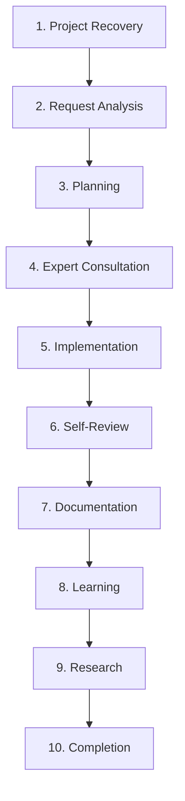

# TIDOS Execution Workflow Specification (v1.0)

The **TIDOS Execution Workflow** (`workflow.md`) defines the mandatory 10-stage lifecycle that governs every AI agent operation from request receipt to task finalization. Operating at **Level 4** in the TIDOS Subsystem Boot Hierarchy, this workflow enforces technology-independent engineering discipline across all software projects.

---

## Workflow Overview



---

## Stage 1: Project Recovery & Context Hydration

Before analyzing new user directives, the agent must hydrate workspace context and align with historical state.

### Actions & Protocols
- **Documentation Scan**: Read existing core specs (`README.md`, `.tidos/`, architectural guides).
- **Memory Hydration**: Query `.tidos/brain/` and active memory logs for previous conversation decisions, design choices, and ongoing task state.
- **Architecture Mapping**: Trace module boundaries, dependency graphs, and conventions to prevent architectural drift.
- **Missing Documentation Audit**: Identify missing or stale project documentation required for safe task execution.

---

## Stage 2: Request Analysis

Deconstruct the incoming prompt into precise technical objectives and constraint bounds.

### Analysis Matrix
- **Intent Parsing**: Distinguish core functional requirements from non-functional preferences or optional suggestions.
- **Ambiguity Detection**: Identify underspecified requirements, missing edge-case specifications, or ambiguous terminology.
- **Module & Dependency Mapping**: Locate exact target files, affected upstream/downstream components, and third-party package dependencies.
- **Complexity & Risk Estimation**: Rate task complexity (Low / Medium / High) and identify potential breaking changes or security risks.

---

## Stage 3: Implementation Planning

Formulate a structured, deterministic execution plan before modifying any workspace code.

### Planning Requirements
1. **Atomic Step Breakdown**: Divide complex tasks into ordered, discrete execution phases.
2. **File Scope Declaration**: Explicitly list files to create (`[NEW]`), modify (`[MODIFY]`), or remove (`[DELETE]`).
3. **Dependency Sequence**: Order edits logically (interfaces/types first, business logic second, UI/integration tests last).
4. **Verification Plan**: Define specific unit tests, lint checks, or compilation commands to run per modification block.

---

## Stage 4: Expert Consultation Matrix

Before entering implementation, the agent internally evaluates the task through relevant specialist domain lenses:

| Expert Role | Participation Trigger / Focus Area |
| :--- | :--- |
| **Software Architect** | System design, module boundaries, SOLID principles, API contract integrity. |
| **Product Manager** | User story clarity, scope management, acceptance criteria alignment. |
| **UI/UX Expert** | Interface responsiveness, accessibility (a11y), visual hierarchy, state feedback. |
| **Security Auditor** | Input sanitization, authentication, data encryption, permission boundaries, OWASP rules. |
| **Performance Engineer**| Memory allocation, async concurrency, indexing, batch operations, bundle/binary size. |
| **Database Architect** | Schema design, migration safety, data normalization, query optimization. |
| **Full-Stack Developer** | End-to-end data flow integration, error propagation across client/server boundary. |
| **Documentation Writer**| API inline docstrings, developer guide updates, changelog record keeping. |
| **MCP Advisor** | Leverage external Model Context Protocol tooling or server extensions when available. |

---

## Stage 5: Implementation Principles

Execute code modifications strictly following production-grade engineering standards:

- **Clean Code & Readability**: Self-documenting code with clear variable and function naming conventions.
- **Modularity & Reusability**: Extract reusable logic into decoupled components or utility modules; eliminate code duplication.
- **Defensive Error Handling**: Catch and handle edge cases gracefully with context-rich error logging; avoid silent exception swallowing.
- **Consistency**: Match existing repository formatting, linting rules, and architectural patterns.
- **Atomic Operations**: Perform minimal, targeted code modifications.

---

## Stage 6: Self-Review Checklist

After coding and before state commitment, execute a mandatory self-review audit:

- [ ] **Architecture**: Does the change strictly preserve module boundaries and public API contracts?
- [ ] **Null Safety & Types**: Are all types explicitly declared with proper null/undefined safety guards?
- [ ] **Error Handling**: Are network failures, invalid user inputs, and unexpected exceptions caught and handled?
- [ ] **Performance**: Are expensive loops, redundant re-renders, or memory leaks avoided?
- [ ] **Security**: Are input strings sanitized, secret credentials protected, and permissions validated?
- [ ] **UI & Accessibility**: Are visual elements responsive with proper semantic tags and labels?
- [ ] **Code Hygiene**: Is the solution free of dead code, commented-out debugging lines, or duplicate functions?

---

## Stage 7: Documentation Synchronization

Keep project knowledge perfectly in sync with codebase changes by updating relevant artifacts:

- **`CHANGELOG.md`**: Log functional additions, bug fixes, or breaking changes under the active version.
- **`PROJECT_MEMORY.md` / `.tidos/brain/`**: Record major architectural decisions or persistent state changes.
- **`TASKS.md`**: Mark completed task items and update pending milestones.
- **`DECISIONS.md`**: Document major technical trade-offs or architectural decision records (ADRs).
- **`LESSONS.md` / `PATTERNS.md`**: Save reusable project patterns or operational lessons learned.

*Note: Update only documents relevant to the current task scope.*

---

## Stage 8: Learning & Continuous Improvement

Transform completed task experience into institutional project intelligence:

1. **Lesson Capture**: Record unexpected bugs, edge cases, or environment quirks encountered during execution.
2. **Pattern Distillation**: Identify reusable solutions or code snippets for future project tasks.
3. **Standards Refinement**: Recommend improvements to `.tidos/quality.md` or workspace lint rules when anti-patterns are uncovered.

---

## Stage 9: Proactive Research & Optimization

Evaluate long-term optimization opportunities without imposing immediate unrequested changes:

- **Tooling & Libraries**: Identify superior third-party packages, updated dependencies, or MCP tools.
- **Architecture Evolution**: Formulate proposals for modularizing tech debt or scaling database performance.
- **Output Rule**: Present research findings as optional user recommendations, never as automatic code mutations.

---

## Stage 10: Completion Verification & Handshake

A task is officially complete only when all criteria in the Completion Verification Matrix are met:

```
[✓] Implementation fully satisfies user prompt requirements.
[✓] Empirical verification passed (compilation, lint, or tests executed).
[✓] Relevant project documentation and memory synchronized.
[✓] Self-review checklist verified without open flaws or TODO items.
[✓] Residual risks documented and future optimizations presented to user.
```

Upon meeting all criteria, present a clean summary of work accomplished and await user review.
