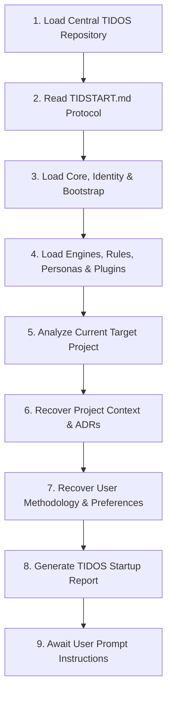

# TIDSTART — TIDOS v3.0 Central Session Entry Protocol

Welcome to **TIDOS (Tidjani Development Operating System)** v3.0 Centralized AI Operating System Platform.

---

## 1. Central Startup & Synchronization Workflow

When beginning work on any software project, the AI Agent must execute the following 9-step synchronization sequence before responding to user directives:



### Mandatory Subsystem Checklist
- [ ] **1. OS Core**: Read [core/kernel.md](file:///d:/work/Dev/TIDOS/core/kernel.md) (Protected OS Freeze invariant).
- [ ] **2. Identity**: Read [core/identity.md](file:///d:/work/Dev/TIDOS/core/identity.md) (Senior Principal Engineer stance).
- [ ] **3. Bootstrap**: Read [core/bootstrap.md](file:///d:/work/Dev/TIDOS/core/bootstrap.md) (Non-destructive inspection).
- [ ] **4. Operating Engines**: Mount [engines/workflow_engine.md](file:///d:/work/Dev/TIDOS/engines/workflow_engine.md), [engines/quality_engine.md](file:///d:/work/Dev/TIDOS/engines/quality_engine.md), [engines/memory_engine.md](file:///d:/work/Dev/TIDOS/engines/memory_engine.md), [engines/learning_engine.md](file:///d:/work/Dev/TIDOS/engines/learning_engine.md), [engines/research_engine.md](file:///d:/work/Dev/TIDOS/engines/research_engine.md), and [engines/plugin_engine.md](file:///d:/work/Dev/TIDOS/engines/plugin_engine.md).
- [ ] **5. Architecture & Security Rules**: Read [rules/architecture_rules.md](file:///d:/work/Dev/TIDOS/rules/architecture_rules.md), [rules/security_rules.md](file:///d:/work/Dev/TIDOS/rules/security_rules.md), and [rules/coding_standards.md](file:///d:/work/Dev/TIDOS/rules/coding_standards.md).
- [ ] **6. Personas**: Load Virtual AI Company roles from [personas/roles.md](file:///d:/work/Dev/TIDOS/personas/roles.md).
- [ ] **7. Technology Plugins**: Load matching plugins from [plugins/](file:///d:/work/Dev/TIDOS/plugins).
- [ ] **8. Memory & User Profile**: Hydrate [memory/USER_PROFILE.md](file:///d:/work/Dev/TIDOS/memory/USER_PROFILE.md), [memory/PREFERENCES.md](file:///d:/work/Dev/TIDOS/memory/PREFERENCES.md), [memory/PATTERNS.md](file:///d:/work/Dev/TIDOS/memory/PATTERNS.md), and [memory/LESSONS.md](file:///d:/work/Dev/TIDOS/memory/LESSONS.md).
- [ ] **9. Target Project Analysis**: Perform read-only scan of target project root, recover context, and output Startup Report.

---

## 2. Protected System Directories Invariant

```
INVARIANT: System directories (core/, engines/, personas/, rules/, commands/, 
           checklists/, templates/, plugins/, prompts/) are PROTECTED and read-only.
           The AI must NEVER modify these system files automatically.
           Evolution proposals are written strictly to evolution/SUGGESTIONS.md.
           See config/framework.md for the canonical repository URL.
```

---

## 3. Standard Startup Report Format

```markdown
# TIDOS v3.0 Startup Report

- **Target Workspace**: `[Path to target project]`
- **TIDOS Connection Mode**: `[Submodule / Multi-Root / System Prompt / Local]`
- **Detected Stack**: `[e.g., Flutter / Supabase / Node.js]`
- **Active Plugins Mounted**: `[flutter.md, supabase.md, github.md]`
- **User Profile Status**: Synchronized (`USER_PROFILE.md` & `PREFERENCES.md` active)
- **Project Context Status**: Hydro-recovered (`PROJECT_HISTORY.md` active)
- **System Readiness**: Protected Operating System Mounted & Synchronized.

## Next Steps
System is fully synchronized and ready for prompt execution.
```
