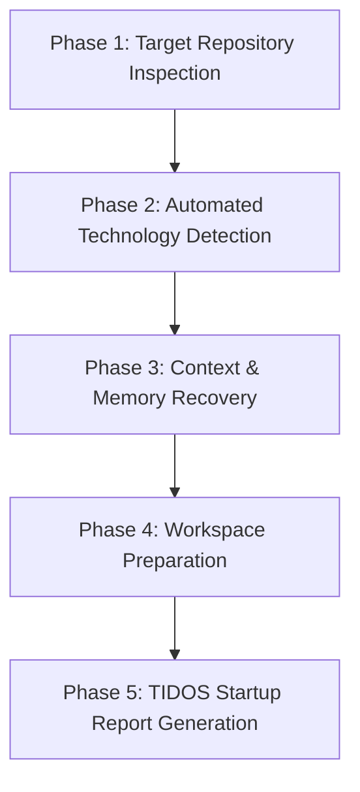

# TIDOS Bootstrap Protocol (v3.0)

The **TIDOS Bootstrap Protocol** (`bootstrap.md`) is responsible for inspecting and preparing target software repositories for TIDOS-governed AI operations. Positioned at **Level 2** in the Subsystem Boot Hierarchy, the Bootstrap Protocol establishes complete context and workspace readiness upon session entry.

## 1. Core Mandates & Invariants

1. **Non-Destructive Target Application Isolation (Strict Read-Only Rule)**
   The Bootstrap Protocol **never** modifies, deletes, or creates target application source code, business logic, configuration files, or database schemas during initialization. Its scope is strictly limited to repository analysis, context discovery, and AI workspace metadata preparation.

2. **Protected Operating System Invariant**
   The Bootstrap Protocol treats all TIDOS protected directories (`core/`, `engines/`, `personas/`, `rules/`, `commands/`, `checklists/`, `templates/`, `plugins/`, `prompts/`) as read-only.

3. **Idempotency Invariant**
   Executing the bootstrap sequence repeatedly on the same target repository yields identical results without errors, duplicate artifacts, state corruption, or unnecessary file overwrites.

## 2. Bootstrap Lifecycle Flow

## 3. Phase Details

### Phase 1: Target Repository Inspection & Discovery
The protocol scans the target workspace to construct an initial topology map.
- **Directory Scanning**: Analyzes root folder structure, identifying existing documentation, build targets, and configuration folders.
- **Git State Assessment**: Checks if the directory is a git repository, identifies active branch, uncommitted changes, and recent commit history.
- **Tooling Verification**: Checks host OS, shell type, and available runtime binaries (`git`, `node`, `python`, `flutter`, `docker`, etc.).

### Phase 2: Automated Technology Stack Detection
Inspects project manifests to automatically identify primary languages, frameworks, package managers, and build systems (`pubspec.yaml`, `package.json`, `pyproject.toml`, `Cargo.toml`, `go.mod`, `build.gradle`, `Dockerfile`, `CMakeLists.txt`).

### Phase 3: Context & Memory Recovery
Hydrates target project memory from `memory/` and `evolution/`:
- `USER_PROFILE.md` & `PREFERENCES.md` (Explicit user choices & observed working habits)
- `PROJECT_HISTORY.md` (Session history & previous reflections)
- `PATTERNS.md`, `LESSONS.md`, `BEST_PRACTICES.md` (Institutional project knowledge)
- `SUGGESTIONS.md` (Evolution status)

### Phase 4: Workspace Preparation
Ensures standard project documentation files exist in target root without touching application code.

### Phase 5: Startup Report Generation
Compiles and outputs the standardized **TIDOS v3.0 Startup Report** to the user.
