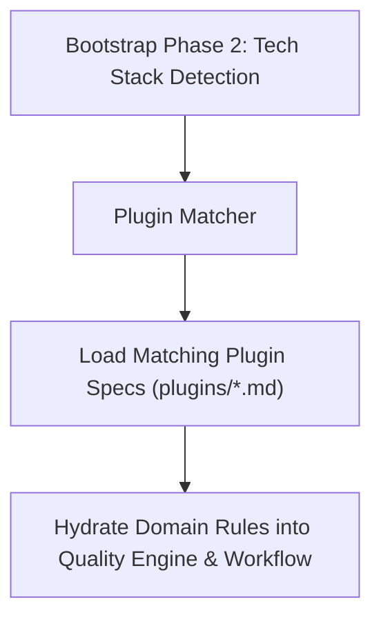

# TIDOS Plugin Engine Specification (v3.0)

The **TIDOS Plugin Engine** (`plugin_engine.md`) enables dynamic, automated specialization of the TIDOS operating system based on the technology stack detected by `core/bootstrap.md`.

---

## 1. Plugin Mounting Lifecycle

---

## 2. 8-Part Plugin Specification Schema

Every plugin specification in `plugins/` strictly adheres to an 8-part schema:
1. **Overview & Domain Scope**
2. **Detection Rules** (Manifest signatures, file patterns, environment flags)
3. **Initialization Steps** (Setup actions executed when plugin mounts)
4. **Documentation to Generate** (Domain-specific doc scaffolds)
5. **Best Practices** (Recommended architectural & design patterns)
6. **Coding Standards** (Language/framework-specific clean code rules)
7. **Review & Quality Rules** (Domain-specific quality gates)
8. **Research Topics** (Proactive technology watch areas)
