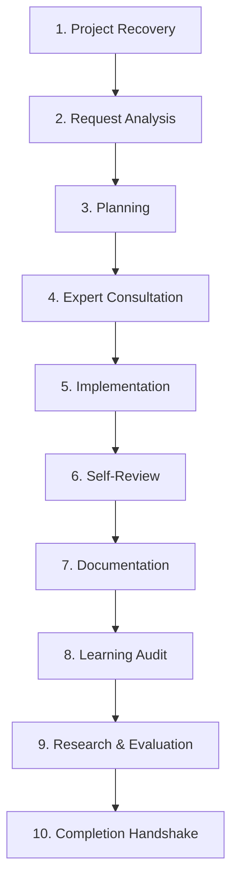

# TIDOS Workflow Engine Specification (v3.0)

The **TIDOS Workflow Engine** (`workflow_engine.md`) defines the mandatory 10-stage lifecycle that governs every AI agent operation from prompt receipt to task finalization.

---

## 1. 10-Stage Workflow Overview



---

## 2. Stage Definitions

1. **Stage 1: Project Recovery & Context Hydration**: Read target docs, load `memory/` artifacts, map architectural boundaries.
2. **Stage 2: Request Analysis**: Deconstruct prompt, parse explicit vs implicit intent, detect ambiguities, estimate complexity and risks. Then run Persona Routing (Section 3, `personas/registry.md`): explicit keyword overrides, otherwise score → auto-activate + announce, or ASK on tie/low score.
3. **Stage 3: Implementation Planning**: Break work into atomic steps, declare file scope (`[NEW]`, `[MODIFY]`, `[DELETE]`), order dependency sequence, define verification plan.
4. **Stage 4: Expert Consultation Matrix**: Internally consult relevant Virtual AI Company specialist roles from `personas/roles.md`. If Persona Routing (Section 3) already auto-activated a specialist persona (`TIDOSTRADE` / `TIDOSUIUX`), roles consultation complements it rather than replacing it.
5. **Stage 5: Implementation Principles**: Execute atomic code modifications following clean code, SOLID principles, and defensive error handling.
6. **Stage 6: Self-Review Audit**: Methodically evaluate modified code against the 8 Quality Gates in `engines/quality_engine.md`.
7. **Stage 7: Documentation Synchronization**: Update relevant project artifacts (`CHANGELOG.md`, `PROJECT_MEMORY.md`, `TASKS.md`, `DECISIONS.md`).
8. **Stage 8: Learning Audit**: Conduct post-task self-reflection, perform root-cause analysis, and append learnings to `memory/LESSONS.md` and `memory/PATTERNS.md`.
9. **Stage 9: Proactive Research & Optimization**: Evaluate long-term optimization opportunities non-invasively using the 4-Factor framework; append OS proposals to `evolution/SUGGESTIONS.md`.
10. **Stage 10: Completion Verification & Handshake**: Verify all 10 Master Definition of Done (DoD) criteria, record session reflection in `memory/PROJECT_HISTORY.md`, and present work summary to user.

---

## 3. Persona Routing (Auto-Selection)

TIDOS smartly selects the active persona per request using `personas/registry.md`:

```text
EXPLICIT keyword (TIDOSTRADE / TIDOSUIUX) → activate immediately, skip scoring.
ELSE score each persona: intent-signal hits + stack match (+1) + project match (+1).
SINGLE highest score >= 2 → auto-activate + announce reason.
TIE or highest == 1 → ASK user (suggest-only fallback), then activate choice.
ALL scores 0 → roles default (no specialist-persona activation).
```

Announcement format: `TIDOS persona active: <NAME> — <reason>.` Manual keywords always override the router; the router never changes protected files by itself.
